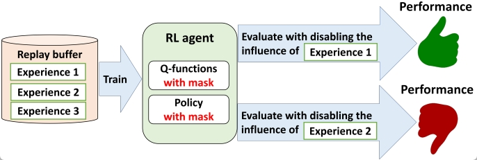

# What is this?

This is the source code for replicating the experiments reported in ["Which Experiences Are Influential for RL Agents? Efficiently Estimating The Influence of Experiences."](https://openreview.net/forum?id=pUvF97zAu9) [(poster)](https://drive.google.com/file/d/1EpZbWdECgLigpdKC6xWGFllVwLnd41to/view?usp=sharing)

This codebase provides a method to estimate and disable the influence of experiences on the performance of reinforcement learning (RL) agents **WITHOUT** retraining them. 



What is this functionality used for? This functionality can be used to debug RL agents. 
When an RL agent fails to learn properly, identifying and disabling the experiences that negatively affect the agent can improve its performance. 
The following videos demonstrate examples of this debugging process: 

https://github.com/user-attachments/assets/07d14535-bf16-4069-893a-f08f9ee9c7c7

https://github.com/user-attachments/assets/a47d8a54-a794-4e04-a48d-05e03ad31e9e


# Requirements
You can install the required libraries using `pip install -r requirements.txt`, except for `mujoco_py`. 

Note that you need a licence to install `mujoco_py`. For installation, please follow instructions [here](https://github.com/openai/mujoco-py).


# Usage
Currently, this codebase supports [SAC](https://proceedings.mlr.press/v80/haarnoja18b.html), [DroQ](https://openreview.net/forum?id=xCVJMsPv3RT), and [reset](https://proceedings.mlr.press/v162/nikishin22a) agents.

To estimate the influence of experiences on a SAC agent, run `main-TH.py`, e.g., 
```
python main-TH.py -info SAC+ToD -env Hopper-v2 -seed 0 -gpu_id 0 -layer_norm 1 -layer_norm_policy 1
```

For DroQ and reset agents, you can specify the arguments `-target_drop_rate` and `-reset_interval` respectively and then run `main-TH.py`, e.g., 
```
python main-TH.py -info DroQ+ToD -env Hopper-v2 -seed 0 -gpu_id 0 -layer_norm 1 -layer_norm_policy 1 -target_drop_rate 0.01
```
```
python main-TH.py -info reset+ToD -env Hopper-v2 -seed 0 -gpu_id 0 -layer_norm 1 -layer_norm_policy 1 -reset_interval 100000
```
Additional examples of execution commands can be found in the scripts `run_experiment-pitod.sh` and `run_experiment-pitod-reset-droq.sh`.

The experimental results will be recorded in the `runs` directory. This folder will contain logs of the agent's learning, evaluation, and the results of experience influence estimation on returns and Q-estimation bias. 

To visualize the results, run the following command:
```
python plot_main_results_pitod.py
```
