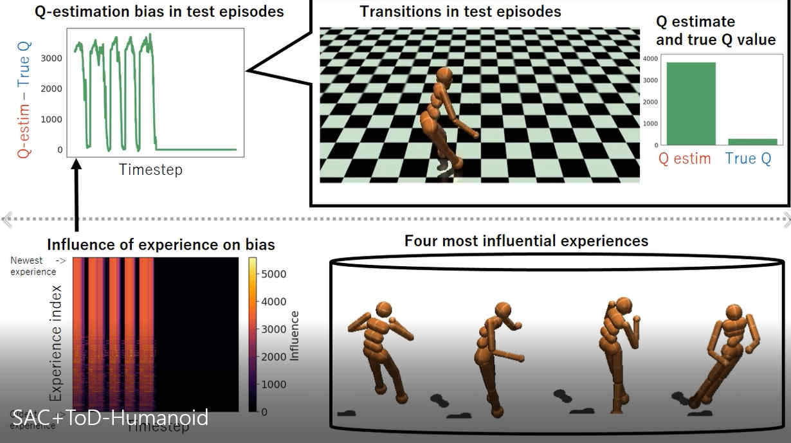
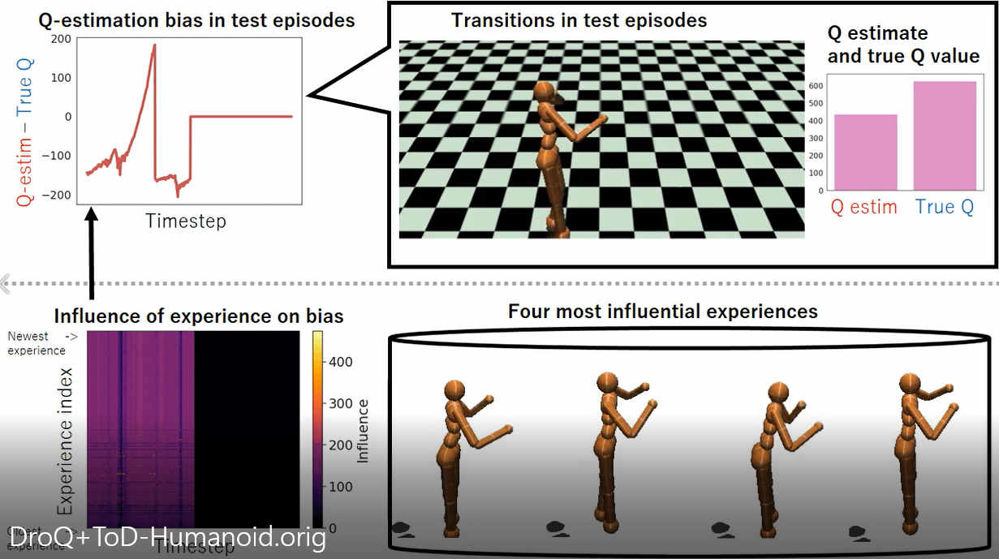

:warning: tod.py in this codebase contains the bug that the mask in which all elements are 1 is assigned to an experience with a high index number. A bug fix will be made later. :warning: 


# What is this?
This is the source code to replicate the experiments provided in [``Which Experiences Are Influential for Your Agent? Policy Iteration with Turn-over Dropout''](https://arxiv.org/abs/2301.11168)

The code provides an efficient method for estimating the influence of experiences stored in the replay buffer on performance (e.g. Q-estimation bias). 

**Demo video1: Visualization of the influence of experiences for SAC (SAC+ToD) in Humanoid**
[](https://drive.google.com/file/d/1jtQP0VVuJzPX778DtvgvSDE-mCD0wrbv/view?usp=share_link "SAC")

**Demo video2: Visualization of the influence of experiences for REDQ (REDQ+ToD) in Humanoid**
[](https://drive.google.com/file/d/1mQ4GnF_HYEbUgImxFHdl1zeTu4rjXEvA/view?usp=share_link "REDQ")

**Demo video3: Visualization of the influence of experiences for DroQ (DroQ+ToD) in Humanoid**
[](https://drive.google.com/file/d/18Xieotx8Okfx1fQrasI82Vz-QcvZJRoM/view?usp=sharing "DroQ")

# How to use this?
You can train agents as following examples.
# SAC+ToD agent
```
python main.py -info sac -env Hopper-v2 -seed 0 -eval_every 1000 -frames 100000 -eval_runs 10  -gpu_id 0 -updates_per_step 20 -method sac -target_entropy -1.0 -turn_over_dropout_rate 0.9 -apply_only_at_last_Q ToD LN -apply_only_at_last_Pol ToD LN -layer_norm 1 -layer_norm_policy 1
```

# REDQ+ToD agent
```
python main.py -info redq -env Hopper-v2 -seed 0 -eval_every 1000 -frames 100000 -eval_runs 10 -gpu_id 0 -updates_per_step 20 -method redq -target_entropy -1.0 -turn_over_dropout_rate 0.9 -apply_only_at_last_Q ToD LN -apply_only_at_last_Pol ToD LN -layer_norm 1 -layer_norm_policy 1
```

# DroQ+ToD agent
```
python main.py -info drq -env Hopper-v2 -seed 0 -eval_every 1000 -frames 100000 -eval_runs 10 -gpu_id 7 -updates_per_step 20 -method sac -target_entropy -1.0 -target_drop_rate 0.005 -layer_norm 1 -turn_over_dropout_rate 0.9 -apply_only_at_last_Q ToD -apply_only_at_last_Pol ToD LN -layer_norm 1 -layer_norm_policy 1
```

# Results

The experimental results (e.g., records of returns, estimation bias) will be created in the ``runs'' directory.


# Note

Part of this source code (./customenvs) is based on the code in [1] (MIT license) with no major changes.  

Part of this source code (./tod) is based on the code in [2] with minor changes. 

The main part of this source code is based on the code in [3] (MIT license). 


[1] https://github.com/JannerM/mbpo/tree/master/mbpo/env

[2] https://github.com/soskek/turnover_dropout

[3] https://github.com/watchernyu/REDQ
